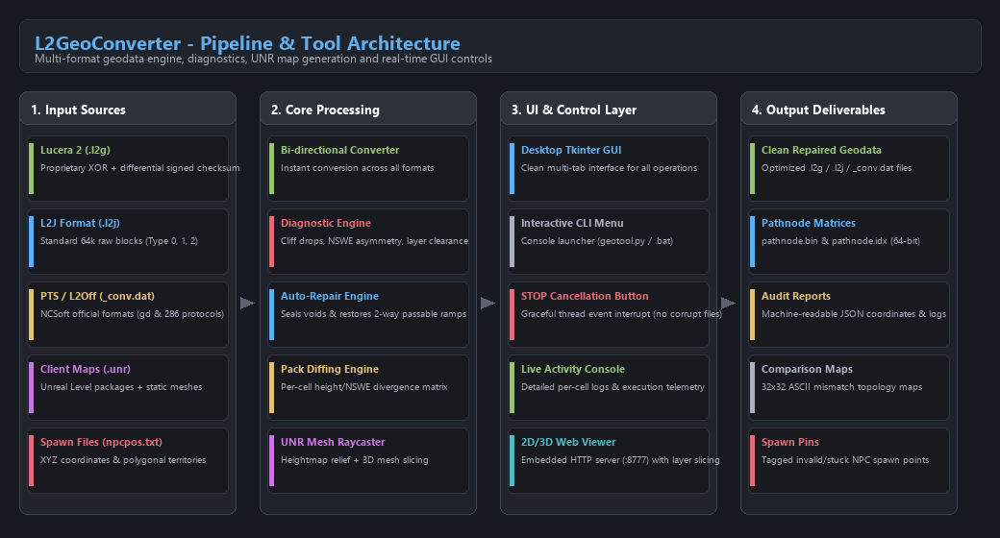

# Visual Guide & Geodata Engineering Handbook

A technical reference for Lineage 2 geodata architecture, collision evaluation, invisible barriers, and automated repair mechanics.

---

## 1. Tool Pipeline & Workflow

`L2GeoConverter` operates directly on binary cell matrices across all Lineage 2 emulator and official server formats:

<p align="center">
  
</p>

### Key Execution Capabilities
* **Format conversion**: Bi-directional conversion between Lucera 2 (`.l2g`), standard Java emulators (`.l2j`), and official PTS / L2Off (`_conv.dat`).
* **Integrity auditing & repair**: Detects and neutralizes dangerous cliff drops, one-way wall traps, and multilayer squeeze clearances.
* **Client extraction**: Generates geodata directly from Unreal level packages (`.unr`) and static meshes with raycast collision filters.
* **Diff engine & spawn validation**: Identifies cell divergence between packs and verifies that `npcpos.txt` spawns land on solid walkable ground.

---

## 2. NSWE Directional Flags & Creating Invisible Barriers

In Lineage 2, the game world is arranged in a hierarchical grid:
* **Region**: $256 \times 256$ blocks ($2048 \times 2048$ cells, representing a map tile such as `20_20`).
* **Block**: $8 \times 8$ cells ($64$ cells).
* **Cell**: $16 \times 16$ world units. Stores a 16-bit signed elevation ($Z$) and a 4-bit NSWE directional bitmask.

<p align="center">
  
</p>

### NSWE Bitmask Specification

| Bit | Flag | Direction | Hex Mask | Meaning |
|---|---|---|---|---|
| bit 0 | `FLAG_EAST` | $+X$ | `0x01` | Allows player/NPC movement East |
| bit 1 | `FLAG_WEST` | $-X$ | `0x02` | Allows player/NPC movement West |
| bit 2 | `FLAG_SOUTH` | $+Y$ | `0x04` | Allows player/NPC movement South |
| bit 3 | `FLAG_NORTH` | $-Y$ | `0x08` | Allows player/NPC movement North |
| bits 0-3 | `FLAG_ALL` | All | `0x0F` | Fully walkable in all directions |
| none | `FLAG_NONE` | None | `0x00` | Solid obstacle / impenetrable column |

### How to Create Invisible Barriers

An invisible barrier is a boundary where the elevation looks completely open and flat in the game client, but the server's collision matrix forbids traversal.

#### Method 1: Directional Invisible Wall
To create a clean impassable line between two adjacent cells without altering their height:
1. Identify the two cells at the border: Cell A at $(gx, gy)$ and Cell B at $(gx+1, gy)$.
2. Strip the crossing flags:
   - On Cell A: remove `FLAG_EAST` (`nswe &= ~0x01`).
   - On Cell B: remove `FLAG_WEST` (`nswe &= ~0x02`).
3. Keep the height identical ($Z_A = Z_B = 100$).
4. **Result**: A player attempting to walk East from Cell A is denied exit by Cell A's bitmask, and denied entry by Cell B's bitmask. The player hits an invisible physical wall.

#### Method 2: Solid 16x16 Obstacle Column
To block an entire area (e.g. an invisible perimeter around an event arena or inaccessible decorative prop):
1. For every cell inside the obstacle boundary, set `nswe = 0x00` (`FLAG_NONE`).
2. **Result**: Movement into this column from North, South, East, or West is strictly rejected.

#### Method 3: Fixing One-Way Wall Traps (`NSWE_ASYMMETRY`)
When Cell A permits movement East (`0x01`) but neighbor Cell B forbids return West (no `0x02`), a player can walk into Cell B but cannot return, becoming trapped.
Running `L2GeoConverter` with `--fix` checks neighbor pairs:
* If the elevation difference is walkable ($|\Delta Z| \le 32$), it closes the open side (`layers[i] &= ~FLAG_EAST`, `n_layers &= ~FLAG_WEST`). It never opens a closed flag: without the original collision a one-sided wall cannot be told apart from a missing flag.
* Layers are paired by nearest height from **both** cells, so an upper layer that exists only on the neighbour is still checked for drops.

---

## 3. Cliff Drops & Archway Doorway Preservation

<p align="center">
  
</p>

### The Cliff Fall Hazard (`CLIFF_FALL`)
When terrain drops steeply ($|\Delta Z| > 48$) and the passage flag remains open, moving characters fall into the abyss or clip under the landscape.
* **Auditing**: Scans all cell borders where $|\Delta Z| > 48$ and $Z_1 > Z_2$.
* **Auto-Repair**: Strips the directional flag on the upper cell facing the drop.

### Archway Preservation (The Giran Bug Fix)
In city portals, tunnels, and town arches (e.g., Giran luxury gate, Dion arches), a cell underneath the arch has multiple layers:
* Layer 0: Ground level ($Z = 96$).
* Layer 1: Arch roof / lintel ($Z = 384$).

The adjacent street cell outside the arch has only one layer (Ground $Z = 96$).

* **The Naive Bug**: Comparing closest layers matches the arch roof ($Z=384$) with the street ground ($Z=96$), detecting $\Delta Z = 288 > 48$. Naive tools stripped movement flags from **both cells**, which deleted the street ground flag and bricked the entrance.
* **The fa1thDEV Fix**: When a cliff is detected, the blocking flag is applied **strictly to the higher layer towards the drop** ($h > nh$). The ground level ($Z=96 \leftrightarrow Z=96$) remains completely open with bidirectional movement flags intact.

---

## 4. Block Architecture & Clearance Rules

<p align="center">
  
</p>

### Block Types
* **Type 0 (Flat)**:
  - 1 height value for all 64 cells.
  - 2 bytes per block on disk.
  - Used for calm water, flat plains, and unpopulated terrain.
* **Type 1 (Complex)**:
  - 64 independent cells, each with 16-bit $Z$ and 4-bit NSWE.
  - 128 bytes per block on disk.
  - Used for irregular hills, slopes, roads, and walls.
* **Type 2 (Multilayer)**:
  - Variable number of layers per cell.
  - Used for bridges, castle keeps, towers, and underground dungeons.

### Vertical Clearance Rule (`LAYER_SQUEEZE`)
In multilayer blocks, two consecutive layers in the same cell must have at least **32 units** of vertical clearance ($|Z_1 - Z_2| \ge 32$). If the ceiling is lower than 32 units, players and NPCs will suffer rubberbanding and severe collision glitches.

---

## 5. Python Example: Programmatic Cell Modification

You can use `geolib` directly in Python scripts to inspect or modify geodata:

```python
from geolib.formats import parse_region, encode_region_l2j
from geolib.diagnostics import get_cell_layers, set_cell_layers, FLAG_EAST, FLAG_WEST

# 1. Parse a region (e.g. 20_20.l2j)
blocks = parse_region("path/to/20_20.l2j")

# 2. Inspect cell at (gx=100, gy=200)
layers = get_cell_layers(blocks, 100, 200)
print("Layers at cell:", layers)  # [(height, nswe), ...]

# 3. Create an invisible barrier to the East
h, nswe = layers[0]
new_layers = [(h, nswe & ~FLAG_EAST)]
set_cell_layers(blocks, 100, 200, new_layers)

# 4. Save modified geodata
encoded_data = encode_region_l2j(blocks)
with open("path/to/20_20_modified.l2j", "wb") as f:
    f.write(encoded_data)
```

---

## 6. Desktop GUI User Guide

Launch the graphical interface via `L2GeoConverter.exe` or `python gui.py`:

1. **Format Converter Tab**: Select a file or folder, pick your target format (`.l2g`, `.l2j`, or PTS `_conv.dat`), and click **START CONVERSION**.
2. **Diagnostics & Auto-Repair Tab**: Scan for cliff falls, one-way wall bugs, and layer traps. Check **Auto-Repair** to patch all issues automatically.
3. **UNR / Client Generator Tab**: Point to your game client's `Maps` and `StaticMeshes` directories to generate geodata from raw level geometry.
4. **Pack Diff Tab**: Compare two geodata distributions cell-by-cell.
5. **Spawn Validator Tab**: Load `npcpos.txt` and verify that all NPC coordinates land safely on solid surfaces.
6. **Web Viewer Tab**: Start the local HTTP viewer (`http://127.0.0.1:8777`) for interactive 2D and 3D visual inspection.
7. **STOP Controls**: Click **■ STOP / СТОП** at any moment in the console toolbar or in the active tab to safely interrupt long-running tasks.
