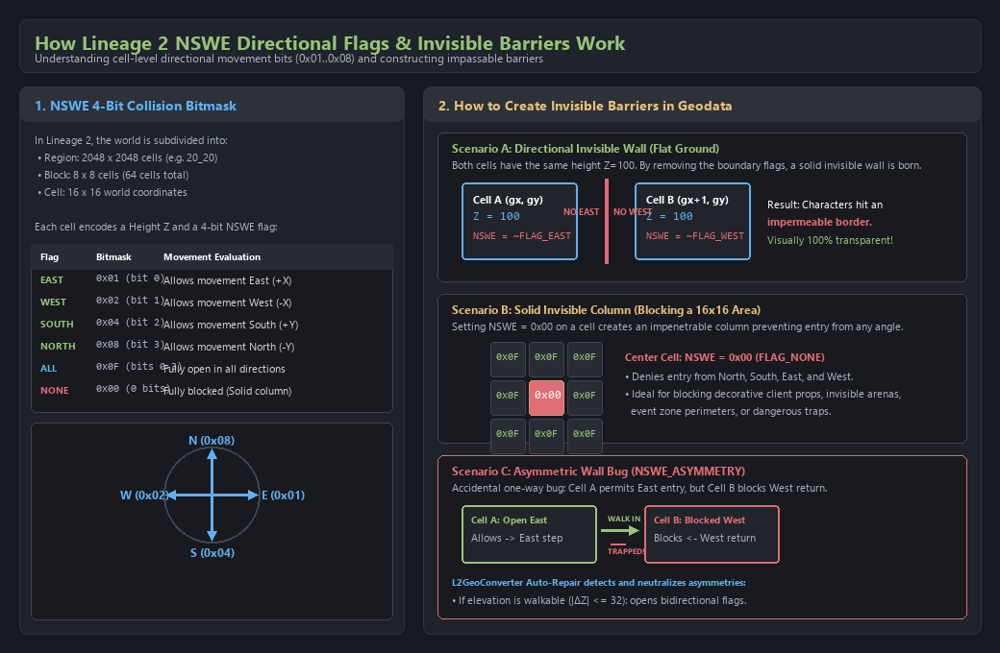
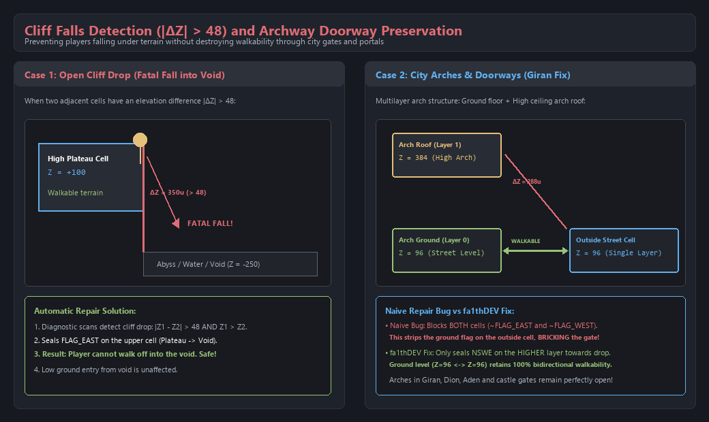
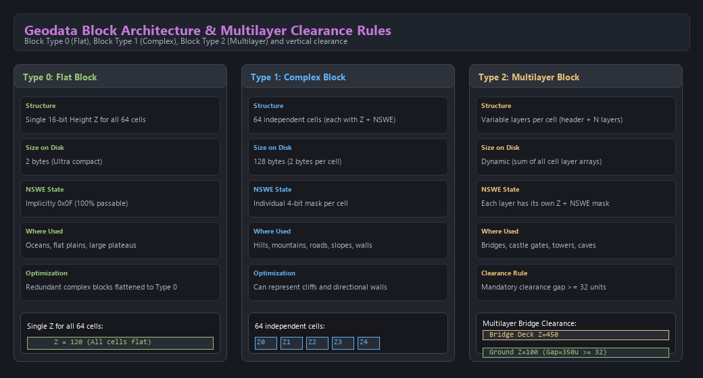

# Manual de Uso - L2 Geodata Converter
**Autor:** fa1thDEV & L2GeoConverter Contributors  
**Ubicación:** `8-Herramientas-y-utilidades\L2Geo_Converter\`  
**Compatibilidad:** Lucera 2 Classic (Deazer Pack), L2J, PTS / L2Off (Interlude, Gracia, High Five, Classic)

---

## 1. Visión General

Esta herramienta permite:
1. **Convertir bidireccionalmente** entre todos los formatos de geodata de Lineage 2:
   - **Lucera 2 (`.l2g`):** Formato encriptado propietario de Lucera 2 con checksum diferencial (usado en `1-Server-copilado/gameserver/geodata/`).
   - **L2J (`.l2j`):** Estándar de emuladores Java sin compresión de encabezado.
   - **PTS / L2Off (`_conv.dat`):** Formato oficial de los servidores de NCSoft (protocolos `gd`, `286`).
2. **Diagnosticar y reparar automáticamente anomalías críticas del mundo**:
   - **Caídas al vacío / Fatal Cliffs (`CLIFF_FALL`):** Celdas transitables con desniveles $|\Delta Z| > 48$ unidades que hacen que los personajes caigan debajo del mapa.
   - **Paredes invisibles unidireccionales (`NSWE_ASYMMETRY`):** Una celda permite el paso hacia un vecino pero el vecino prohíbe el paso de vuelta, creando barreras trampa.
   - **Atrapamientos entre capas (`LAYER_SQUEEZE`):** Bloques multicapa con techos a menos de 32 unidades donde NPCs o jugadores quedan atrapados ("rubberbanding").
   - **Alturas fuera de rango (`OUT_OF_BOUNDS_Z`):** Coordenadas que exceden los límites seguros del motor ($-16384 \le Z \le +16376$).
3. **Visualización Interactiva 2D y 3D en Navegador Web**:
   - Visor de mapas integrado con capas, inspección de celdas en tiempo real y superposición de mallas 3D (`.unr`) del cliente.
4. **Generación y Esculpido Procedural**:
   - Creación de coliseos, rampas, arenas de eventos y aplicación de parches JSON directamente sobre los bloques.

---

## 2. Métodos de Uso

### Método 1: Drag & Drop (1-Click)
Arrastra cualquier archivo `.l2g`, `.l2j` o `_conv.dat` sobre `GeoConverter.bat`:
- Se abrirá un menú contextual con opciones rápidas:
  - `[1]` Diagnóstico completo del archivo.
  - `[2]` Diagnóstico y auto-reparación (`--fix`).
  - `[3]` Conversión de formato (desencriptar/encriptar).
  - `[4]` Conversión a formato PTS / L2Off.

### Método 2: Menú Interactivo
Haz doble clic en `GeoConverter.bat` (o ejecuta `python geotool.py` en la carpeta `l2-geodata-toolkit-main`):
```text
  1  Converter PTS → L2J (XX_YY_conv.dat → XX_YY.l2j)
  2  Browser viewer (map → block → layers)
  3  Compare two packs (per-region report, detailed with a map)
  4  Check a pack (validation, stub search)
  5  Verify PTS ↔ L2J conversion (both ways, per-cell)
  6  Reverse converter L2J → PTS (for G3DEditor etc.)
  7  Generate geodata from the client (Maps + Textures + StaticMeshes)
  8  Compile pathnode.bin/.idx (64-bit PathMaker replacement)
  9  Lucera 2: Decrypt .l2g → .l2j
  10 Lucera 2: Encrypt .l2j → .l2g
  11 Diagnostics & Repair (NSWE walls, cliff drops, layer traps)
  0  Exit
```

### Método 3: Línea de Comandos (CLI)
Puedes invocar `GeoConverter.bat <comando>` o `python geotool.py <comando>`:

#### A. Desencriptar Geodata de Lucera 2 (`.l2g` → `.l2j`)
```powershell
.\GeoConverter.bat l2g2l2j "geodata/16_20.l2g" -o ./salida_l2j -y
```

#### B. Encriptar Geodata para Lucera 2 (`.l2j` → `.l2g`)
```powershell
.\GeoConverter.bat l2j2l2g ./salida_l2j/16_20.l2j -o ./salida_l2g -y
```

#### C. Diagnóstico de Errores
```powershell
.\GeoConverter.bat diagnose "geodata/16_20.l2g"
```
Salida en consola:
```text
  Diagnosis: 16_20.l2g (Region 16_20, Format: L2G)
    Asymmetric one-way walls: 2966
    Dangerous cliff drops:    1796
    Layer traps / squeezes:   0
    Out-of-bounds Z errors:   0
    Showing first sample issues:
      [*] (NSWE_ASYMMETRY) @ World(-130824, 94856): One-way East passage to (16,1832) but neighbor denies West entry
      [!] (CLIFF_FALL) @ World(-130824, 94856): Hazardous cliff drop of 72u with open East flag (Z1=-4904, Z2=-4976)
```

#### D. Diagnóstico y Auto-Reparación Automática (`--fix`)
```powershell
.\GeoConverter.bat diagnose "geodata/16_20.l2g" --fix -o ./geodata_reparada
```
- Repara sellando flags hacia desniveles infranqueables y garantizando simetría bidireccional en rampas transitables ($\Delta Z \le 32$).

#### E. Modo JSON para Integración y Scripts (`--json`)
```powershell
.\GeoConverter.bat diagnose "geodata/16_20.l2g" --json
```
Devuelve un objeto JSON estándar con las coordenadas de mundo `(X, Y, Z)` exactas para cada anomalía:
```json
[
  {
    "stats": {
      "region": "16_20",
      "format": "l2g",
      "asymmetry_errors": 2966,
      "cliff_errors": 1796,
      "layer_squeeze_errors": 0,
      "out_of_bounds_errors": 0
    },
    "sample_issues": [
      {
        "severity": "CRITICAL",
        "type": "CLIFF_FALL",
        "geo": [16, 1832],
        "world": [-130824, 94856],
        "msg": "Hazardous cliff drop of 72u with open East flag (Z1=-4904, Z2=-4976)"
      }
    ]
  }
]
```

#### F. Visor Web en Navegador (2D / 3D)
```powershell
.\GeoConverter.bat view "geodata"
```
Abre un servidor HTTP local en `http://127.0.0.1:8777` donde puedes explorar visualmente cualquier región, celda y bloque del servidor.

---

## 3. Uso Programático con Python

### A. Cargar, Modificar y Guardar Geodata con `l2geo_core.py`
```python
from l2geo_core import load_geodata, save_geodata, FLAG_ALL, FLAG_NONE

# Carga automática detectando .l2g, .l2j o .dat
region = load_geodata("1-Server-copilado/gameserver/geodata/16_20.l2g")

# Consultar altura y movimiento en coordenadas de mundo
gx, gy = region.world_to_geo(-130824, 94856)
z = region.get_height(gx, gy)
nswe = region.get_nswe(gx, gy)

# Esculpir una plataforma transitable
for x in range(gx, gx + 10):
    for y in range(gy, gy + 10):
        # Modificar celda
        pass

# Guardar directamente en formato Lucera 2 encriptado
save_geodata(region, "16_20_modificado.l2g")
```

### B. Generación y Parches con `l2geo_generator.py`
```python
from l2geo_generator import sculpt_flat_plateau, create_flat_region, apply_geo_patch_json

# Crear una región vacía lista para poblar
region = create_flat_region(region_x=20, region_y=20, default_z=0)

# Esculpir un coliseo elevado de 200x200 celdas a altura Z=100
sculpt_flat_plateau(region, start_geo_x=500, start_geo_y=500, width=200, length=200, target_z=100)

# Aplicar parche JSON
patch_spec = {
    "region": "20_20",
    "patches": [
        {
            "type": "plateau",
            "box": [100, 100, 50, 50],
            "z": 50,
            "nswe": 15
        }
    ]
}
apply_geo_patch_json(region, patch_spec)
```

---

## 4. Guía Visual: Creación de Barreras Invisibles y Diagnóstico

### A. Estructura NSWE y Creación de Barreras Invisibles

Cada celda de geodata ($16 \times 16$ unidades de mundo) almacena su cota $Z$ y una máscara de 4 bits que define el paso hacia los vecinos:

| Bit | Flag | Dirección | Hex | Función |
|---|---|---|---|---|
| bit 0 | `FLAG_EAST` | $+X$ (Este) | `0x01` | Permite avanzar hacia el Este |
| bit 1 | `FLAG_WEST` | $-X$ (Oeste) | `0x02` | Permite avanzar hacia el Oeste |
| bit 2 | `FLAG_SOUTH` | $+Y$ (Sur) | `0x04` | Permite avanzar hacia el Sur |
| bit 3 | `FLAG_NORTH` | $-Y$ (Norte) | `0x08` | Permite avanzar hacia el Norte |
| bits 0-3 | `FLAG_ALL` | Todas | `0x0F` | Suelo completamente abierto y transitable |
| 0 bits | `FLAG_NONE` | Ninguna | `0x00` | Obstáculo sólido / columna infranqueable |

<p align="center">
  
</p>

#### Pasos para Crear una Pared Invisible:
1. **Pared Direccional (Suelo plano)**:
   - Se mantienen ambas celdas a la misma altura ($Z=100$).
   - En la celda izquierda $(gx, gy)$: se retira el flag Este: `nswe &= ~0x01`.
   - En la celda derecha $(gx+1, gy)$: se retira el flag Oeste: `nswe &= ~0x02`.
   - El cliente de juego dibuja el suelo normal y abierto, pero el motor de colisiones del servidor rechaza cualquier paquete de movimiento que intente cruzar el límite.
2. **Columna / Bloque Sólido**:
   - Asignar `nswe = 0x00` a la celda completa. Ningún personaje puede entrar desde ningún ángulo.
3. **Paredes Trampa Unidireccionales (`NSWE_ASYMMETRY`)**:
   - Ocurre cuando una celda permite ir al Este, pero la contigua prohíbe volver al Oeste. El jugador entra pero queda atrapado. La herramienta detecta estas asimetrías y las repara con `--fix`.

---

### B. Detección de Caídas y Preservación de Arcos y Puertas (Fix de Girán)

<p align="center">
  
</p>

* **Precipicios Fatales (`CLIFF_FALL`)**: Cuando entre dos celdas adyacentes existe un desnivel $|\Delta Z| > 48$ con bandera de paso abierta hacia el vacío, los jugadores caen debajo del mapa. El reparador sella el flag en la celda superior.
* **Preservación de Puertas y Arcos**: En portales de ciudades (como los arcos de Giran o Dion), la celda del arco tiene suelo ($Z=96$) y techo ($Z=384$), mientras que la celda exterior sólo tiene suelo ($Z=96$). Al comparar capas cercanas, el algoritmo antiguo borraba el flag de paso de **ambas** celdas, sellando la puerta. `L2GeoConverter` aplica el bloqueo **exclusivamente a la capa superior en dirección al vacío**, manteniendo el tránsito a ras de suelo $100\%$ transitable.

---

### C. Tipos de Bloque y Holgura Vertical

<p align="center">
  
</p>

* **Tipo 0 (Flat)**: 1 sola altura para las 64 celdas del bloque. Ocupa 2 bytes.
* **Tipo 1 (Complex)**: 64 celdas independientes ($Z$ + NSWE). Ocupa 128 bytes.
* **Tipo 2 (Multilayer)**: Varias capas por celda (puentes, mazmorras, murallas). Las capas sucesivas deben guardar al menos 32 unidades de distancia vertical para evitar que los personajes queden atascados.

---

## 5. Detalles Técnicos del Codec Lucera 2 (`.l2g`)

El servidor Lucera 2 (`l2.gameserver.geodata.GeoEngine`) carga los archivos `.l2g` con el siguiente algoritmo:
1. Lee los primeros 4 bytes como entero con signo de 32 bits (Little-Endian): `xorKey`.
2. Calcula la clave inicial: `key = xorKey ^ 0x814467AB` (`L2G_KEY_MAGIC`).
3. Para cada byte `i` en los datos restantes del payload:
   - `decrypted_byte = raw_byte ^ (key & 0xFF)`
   - `key = key - decrypted_byte` (aritmética entera con signo de 32 bits).
4. El payload desencriptado resultante es una estructura estándar L2J (65,536 bloques de tipos 0=Flat, 1=Complex, 2=Multilayer).
5. En la encriptación (`L2GCodec.encrypt`), generamos una clave aleatoria y replicamos exactamente el flujo inverso, garantizando **100% de compatibilidad binaria**.
